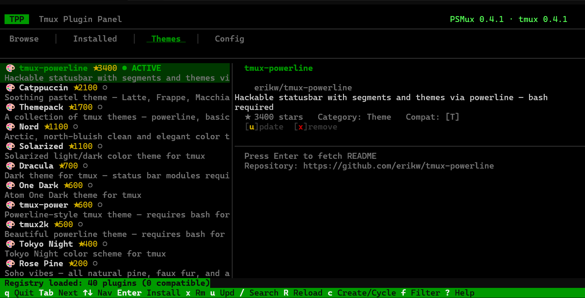

<p align="center">
  
  
  
  <a href="https://crates.io/crates/tmuxpanel"></a>
  <a href="https://community.chocolatey.org/packages/tmuxpanel"></a>
</p>

<h1 align="center">⌨️ Tmux Plugin Panel</h1>

<p align="center">
  <b>A full-featured TUI plugin manager for tmux — the modern alternative to TPM.</b><br>
  Browse, install, remove, update, and theme your tmux — all from a beautiful terminal interface.
</p>

<p align="center">
  <code>cargo install tmuxpanel</code>&nbsp;&nbsp;·&nbsp;&nbsp;<code>choco install tmuxpanel</code>&nbsp;&nbsp;·&nbsp;&nbsp;<code>scoop install tmuxpanel</code>&nbsp;&nbsp;·&nbsp;&nbsp;<code>winget install marlocarlo.tmuxpanel</code>
</p>

<p align="center">
  
</p>

---

## Installation

### Via Cargo (crates.io)

```bash
cargo install tmuxpanel
```

### Via Chocolatey

```powershell
choco install tmuxpanel
```

### Via Scoop

```powershell
scoop bucket add tmuxpanel https://github.com/marlocarlo/scoop-tmuxpanel
scoop install tmuxpanel
```

### Via WinGet

```powershell
winget install marlocarlo.tmuxpanel
```

### From Source

```bash
git clone https://github.com/marlocarlo/Tmux-Plugin-Panel.git
cd Tmux-Plugin-Panel
cargo build --release
./target/release/tmuxpanel
```

After installation, three commands are available:
- **`tmuxpanel`** — Main TUI plugin manager
- **`tmuxplugins`** — Opens directly to the Browse tab
- **`tmuxthemes`** — Opens directly to the Themes browser

---

## Why Tmux Plugin Panel?

[TPM](https://github.com/tmux-plugins/tpm) works, but it's a shell script with no UI, no search, no browsing. **Tmux Plugin Panel** gives you a complete graphical plugin manager — think "app store for tmux" — right inside your terminal:

- **Browse** a curated registry of 40+ plugins, sorted by category and stars
- **Search** GitHub for any tmux plugin in real-time
- **One-key install/remove/update** — no editing config files manually
- **Theme gallery** — preview and switch tmux themes instantly
- **Settings editor** — toggle tmux options (mouse, status bar, keybindings) without memorizing `set -g` syntax
- **Auto-detection** — finds tmux (and PSMux) installations, versions, and config files automatically
- **Config management** — creates, parses, and updates `tmux.conf` / `psmux.conf` for you
- **Offline fallback** — ships with an embedded plugin registry; works without internet

## Features at a Glance

| Tab | What it does |
|-----|-------------|
| **⌂ Dashboard** | Quick-action cards for common tasks. Browse plugins, themes, configure settings, reset to defaults, manage registries. |
| **Browse** | Category sidebar + plugin list + detail panel. Search, filter by compat, install with Enter. |
| **Installed** | See all installed plugins. Update one (`u`), update all (`U`), remove (`x`), clean orphans (`C`). |
| **Themes** | Dedicated gallery for tmux themes. Install, activate, switch — one keypress. |
| **Config** | Full settings editor. Toggle booleans, cycle choices, edit values inline. Grouped by category. Reset individual settings or factory reset. |

## Quick Start

### Prerequisites

- **tmux** installed on your system (or PSMux)
- **git** (for cloning plugins)

### First Run

1. **Tmux Plugin Panel** auto-detects your tmux installation and config file
2. If no `tmux.conf` exists, press `c` to create one
3. Browse plugins → press `Enter` to install
4. Press `R` to reload tmux with your new plugins

## Keybindings

| Key | Action |
|-----|--------|
| `q` | Quit |
| `Tab` / `Shift+Tab` | Switch tabs |
| `1`–`5` | Jump to tab (1=Dashboard, 2=Browse, 3=Installed, 4=Themes, 5=Config) |
| `↑` `↓` / `j` `k` | Navigate list (wraps around) |
| `←` `→` / `h` `l` | Switch category (Browse) / settings group (Config) |
| `Enter` | Install plugin / toggle setting / dashboard action |
| `x` / `d` | Remove plugin (with confirmation) |
| `u` | Update selected plugin |
| `U` | Update **all** plugins |
| `C` | Clean orphaned plugins |
| `/` | Search plugins |
| `f` | Toggle compat filter (tmux / psmux) |
| `r` | Rescan config |
| `R` | Reload tmux config (`tmux source-file`) |
| `c` | Create config / cycle configs |
| `Backspace` | Reset single setting to default (Config tab) |
| `D` | Reset all settings to defaults (Config tab) |
| `Ctrl+D` | Factory reset entire config (Config tab) |
| `p` | Preview plugin/theme |
| `J` / `K` | Scroll README detail |
| `?` | Show help |

## Architecture

```
src/
├── main.rs      # Entry point, terminal setup, event loop
├── app.rs       # Application state machine (5 tabs, selections, data)
├── ui.rs        # TUI rendering with ratatui (dashboard + 4 tabs + overlays)
├── registry.rs  # Plugin registry — embedded + external sources, search/filter
├── plugins.rs   # Git-based install/remove/update engine
├── themes.rs    # Theme management (install, activate, switch)
├── config.rs    # tmux.conf / psmux.conf parser, editor & factory reset
├── detect.rs    # Auto-detection of tmux/PSMux binaries & configs
└── github.rs    # GitHub API client for search & repo info
```

## Plugin Registry

**Tmux Plugin Panel** ships with a curated registry of popular tmux plugins covering:

- ⭐ **Essential** — TPM, tmux-sensible, tmux-256color
- 🎨 **Themes** — Catppuccin, Dracula, Nord, Tokyo Night, Rose Pine, and more
- 💾 **Session** — tmux-resurrect, tmux-continuum
- 🧭 **Navigation** — vim-tmux-navigator, tmux-fzf
- 📊 **Status Bar** — tmux-cpu, tmux-battery, tmux-net-speed
- 📋 **Clipboard** — tmux-yank
- 🔧 **Utility** — tmux-fingers, tmux-open, tmux-logging

The registry is fetched from GitHub on startup and cached locally. An embedded copy is compiled into the binary as a fallback.

### Custom Registry

You can extend the built-in registry by adding external sources (local JSON files or remote URLs). See [REGISTRY_FORMAT.md](REGISTRY_FORMAT.md) for the full schema and setup instructions.

Registry sources are configured in `~/.config/tmuxpanel/registry_sources.json`.

## Tech Stack

- **[Rust](https://www.rust-lang.org/)** — safe, fast, no runtime
- **[ratatui](https://ratatui.rs/)** — modern terminal UI framework
- **[crossterm](https://github.com/crossterm-rs/crossterm)** — cross-platform terminal manipulation
- **[tokio](https://tokio.rs/)** — async runtime for GitHub API calls
- **[reqwest](https://docs.rs/reqwest/)** — HTTP client

## Configuration

**Tmux Plugin Panel** uses the standard TPM plugin syntax in your tmux config:

```bash
# ~/.tmux.conf
set -g @plugin 'tmux-plugins/tmux-sensible'
set -g @plugin 'catppuccin/tmux'
set -g @plugin 'tmux-plugins/tmux-resurrect'
```

Plugins are installed to `~/.tmux/plugins/` by default.

## Environment Variables

| Variable | Purpose |
|----------|---------|
| `GITHUB_TOKEN` or `GH_TOKEN` | Authenticate GitHub API requests (higher rate limits) |

## License

MIT — see [Cargo.toml](Cargo.toml).

## Contributing

Contributions welcome! Feel free to open issues or submit pull requests.

1. Fork the repo
2. Create a feature branch
3. Make your changes
4. Submit a PR

---

<p align="center">
  Built with 🦀 Rust and ❤️ for the terminal
</p>
